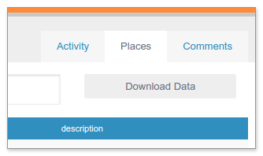

Downloading your Map Data
=========================

From the data dashboard, click on the *Places* tab. From there, click *Download Data*. This will take you to the plan page editor screen.

From the plan page editor, scroll down to the map section. At the bottom of this section should be a link that says *Download Map Data...* Clicking this link will request that the server generate a "snapshot" of your data. Once your snapshot has been generated (this may take up to a few minutes), you can click the resulting button to download your snapshot in CSV format.

